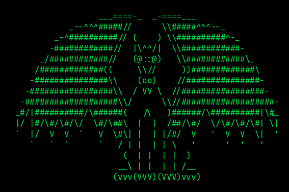
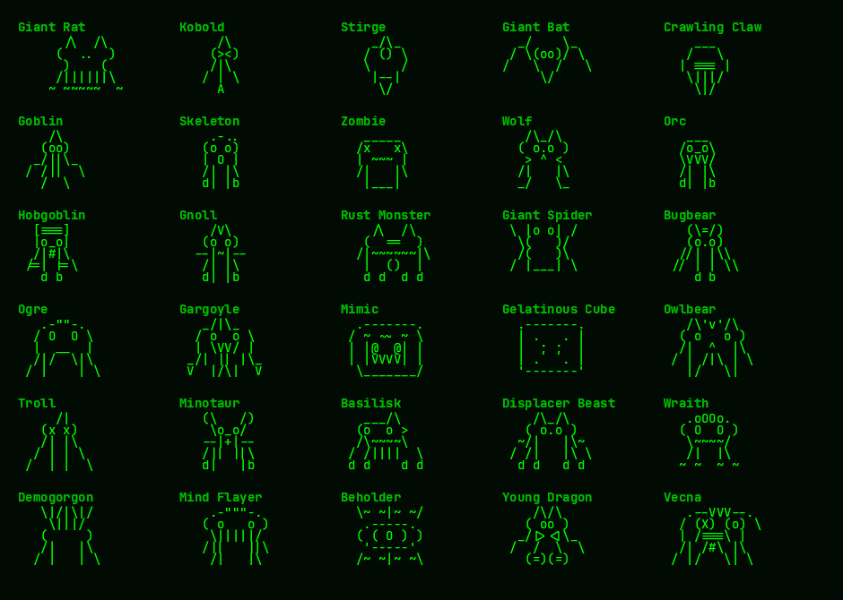
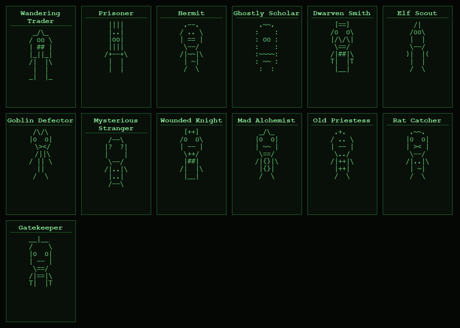

# D&D 5e Text Adventure

A retro terminal-style Dungeons & Dragons 5th Edition RPG for iOS and macOS, with AI Dungeon Master support.

## Features

### Character Creation
- **12 Races**: Human, High Elf, Wood Elf, Hill Dwarf, Mountain Dwarf, Lightfoot Halfling, Stout Halfling, Half-Elf, Half-Orc, Rock Gnome, Tiefling, Dragonborn
- **6 Classes**: Fighter, Wizard, Rogue, Cleric, Ranger, Barbarian
- **Ability Scores**: Standard array or 4d6 drop lowest
- **Ability Score Improvement**: raise an ability score by 2 (your choice, capped at 20) at D&D 5e ASI levels as you level up
- **Experience & Leveling**: standard D&D 5e XP thresholds — Level 2 at 300 XP, Level 3 at 900 XP, Level 4 at 2,700 XP, Level 5 (cap) at 6,500 XP. Earned from combat and awarded by the DM; shown on Party Status alongside how much is needed for the next level
- **18 Skills** with proficiency system
- **Parties** of 1-4 characters (human or AI-controlled)
- **Long-press** any party size to auto-generate an all-AI party
- **Name suggestions** drawn from D&D shows, films, and sci-fi classics (Stranger Things, Community, Futurama, Dune, The Matrix, and more)
- **DnD-dex** [showing character and location cards used as the name suggestions in the game](https://proflewis.github.io/gamer/ios_card_images/card-dex/index.html).

### Combat (D&D 5e Rules)
- Initiative, attack rolls, saving throws, critical hits
- Death saving throws (nat 20 revive, nat 1 double failure)
- Class features: Sneak Attack, Rage, Second Wind, Hunter's Mark
- **Dodge** grants attackers disadvantage on their next attack
- **Play Dead** — bluff your way out of a fight (CHA + Deception check)
- **Flee** — escape to the previous room
- Creative actions via the AI DM
- Monsters grouped by type with numbered targeting
- **Poison** — venomous creatures can poison party members (CON save to recover)

### Spellcasting
- **Wizard**: Fire Bolt, Ray of Frost, Magic Missile, Burning Hands, Sleep
- **Cleric**: Sacred Flame, Cure Wounds, Guiding Bolt, Healing Word, Spare the Dying
- **Ranger**: Hunter's Mark, Cure Wounds
- Cantrips (unlimited) and spell slots that recover on long rest

### Procedural Dungeons
- 11 room types: corridors, chambers, treasure rooms, armories, shrines, libraries, prisons, trap rooms, boss chambers, and more
- ASCII minimap showing only visited rooms with dynamic key (only shows symbols present on the map) — merchant rooms are marked with `[M]`
- Encounters and traps scaled by dungeon level
- Treasure, equipment, and potions throughout; shop rooms always have a merchant, and armouries sometimes do too
- Multi-level progression — defeat the boss to descend deeper

### Merchants
- **4 tiers**, scaling with dungeon depth: Wandering Peddler, General Store, Trading Post, and Hyperstore
- Each merchant is a named character with their own shop name and persona, not a generic vendor
- **Buy, Sell, Haggle** (a Persuasion check for a discount), and **Ask About Rare Goods** (a chance at an under-the-counter item at a premium)
- Merchants occasionally offer unsolicited advice
- Bargaining and rare-goods outcomes are always resolved as real game mechanics (dice rolls, item tables) — the DM only narrates on top, so it works with cloud AI, Apple on-device AI, or no AI at all
- Found in shop rooms (guaranteed once per dungeon level), some armouries, and via Wandering Trader NPCs — a **Visit Merchant** button appears whenever one is present

### Training Gyms
- Found by chance in chamber rooms, run by a named trainer with a specialty skill
- Get in by **paying a membership fee** or **sparring** (a skill check against the trainer) for free entry
- Training teaches a character a new skill proficiency outright, or a small XP bonus if they already have it
- A **Visit Gym** button appears whenever one is present, marked `[G]` on the minimap

### 30 Monsters

The dungeon is home to 30 different creature types, from lowly rats and kobolds to terrifying beholders and dragons.

### 13 NPCs

Friendly NPCs appear in dungeon rooms — traders, healers, scholars, smiths, scouts, and more. Talk to them for quests, services, and lore. The Gatekeeper guards the entrance and offers gold rewards for clearing the dungeon.

### AI Dungeon Master

The game has three tiers of DM intelligence:

1. **Basic DM** (all devices) — A simple built-in DM with canned responses. Works everywhere but gives only very basic room descriptions and atmosphere. No AI, no setup needed.
2. **Apple On-Device AI** (iPhone 16 / iPad with M-series or newer, iOS 26+) — A much smarter DM that runs entirely on your device. No API key, no account, works offline. May be fussy with some queries — try rephrasing if it won't answer.
3. **Cloud AI** (any device) — The best DM experience. Supports Claude (Anthropic), GPT (OpenAI), and **Gemini (Google — free if you have a Google account, ages 18+)**. Requires an API key configured in Settings.

Features:
- 4 DM levels: Off, Flavour Only, Moderate, Full
- At Moderate+, the DM can grant items, award gold, heal, deal damage, move the party, and teleport
- Ask the DM during exploration or combat for creative actions
- DM actions update the world state in real time (map, inventory, HP)
- ASCII art responses when you ask the DM to draw something
- **DM Voice** — text-to-speech reads DM responses aloud (built into iOS, no API key needed)
- **Speaker Mode** — persistent read-aloud toggle that narrates story text as you play

### Save System
- Save slots with automatic breakpoints (up to 5 per slot)
- Autosave on room changes (configurable interval)
- Load any breakpoint from a slot's history
- Rename and delete save slots

### Character Roster
- Save individual characters independent of game saves — a separate system from Saved Adventures, clearly labelled so it's never confused with them
- **Load Character** during party creation brings a saved character into a new party at their current level, gear, and gold (HP/spell slots/combat state reset for the fresh start)
- **Save to Roster** during party creation, or from Party Status mid-adventure, updates that character's roster entry — so a character can carry level-ups and loot from one adventure into the next
- Up to 20 characters can be kept in the roster

### Hall of Fame
- Scoring: victories, gold, monsters slain, exploration, difficulty multiplier
- Pre-seeded with Stranger Things-themed entries

### Game Center
- Leaderboards: Gold collected, Victories, Monsters slain
- 6 Achievements: First Blood, Dungeon Master, Hoarder, Slayer, Veteran, Legend
- Turn-based multiplayer via Game Center

### Multiplayer
- Turn-based async multiplayer via Game Center
- Host controls exploration; each player controls their own character in combat
- Party chat with @mentions
- Invite friends mid-game or during party setup
- Nudge idle players

### Comprehensive Help System
- 12 help topics: Getting Started, Exploration, Combat, Character & Party, Recovery, Dungeon Master, Multiplayer, Tips & Tricks, FAQs, Bestiary, NPCs, Name Lore
- 50+ FAQ entries organised by topic
- Context-sensitive gameplay tips
- In-game bestiary with ASCII art for all 30 monsters
- Name Lore gallery with character cards and pop culture origins

## Interface

Green-on-black terminal aesthetic with monospaced text, ASCII art for characters and monsters, and a D-pad for dungeon navigation. Features include:
- Configurable font size (small, medium, large, extra large)
- Animated dragon GIF on the main menu
- Swipe-left to go back from any screen
- Voice input via microphone
- Speaker mode for hands-free narration
- Custom on-screen keyboard
- Undo/redo for character editing and settings
- macOS keyboard shortcuts (arrow keys, WASD, letter keys for menus)
- Long-press shortcuts throughout the UI

## Building

Requires Xcode 15.0+. Open `ios/DnDTextRPG/DnDTextRPG.xcodeproj` and build for iOS 16.0+ or macOS.

See [ios/README.md](ios/README.md) for detailed build instructions.

## Testing

- Manual QA checklist covering every system — combat, spells, leveling,
  merchants, riddles, traps, save/load, DM tiers, and more:
  [docs/QA_CHECKLIST.md](docs/QA_CHECKLIST.md)

## iOS/Python Feature Parity

- Current reconciliation status and mapping:
  [docs/ios_python_parity.md](docs/ios_python_parity.md)

## DnDex (Card Dex)

- Browse all generated player, monster, and location cards in the **DnDex** viewer:
  [https://proflewis.github.io/gamer/ios_card_images/card-dex/index.html](https://proflewis.github.io/gamer/ios_card_images/card-dex/index.html)
- Browse the **Rogues Gallery Viewer** (rooms, races, monsters, NPCs, with voice showcase):
  [https://proflewis.github.io/gamer/gallery/index.html](https://proflewis.github.io/gamer/gallery/index.html)
- Deep source references (authors, films, TV, modules, worlds):
  [https://proflewis.github.io/gamer/ios_card_images/card-dex/entities/index.html](https://proflewis.github.io/gamer/ios_card_images/card-dex/entities/index.html)
- Photo provenance for downloaded reference images:
  [https://proflewis.github.io/gamer/ios_card_images/PHOTO_SOURCES.md](https://proflewis.github.io/gamer/ios_card_images/PHOTO_SOURCES.md)
- Markdown catalogs for direct image links:
  [https://proflewis.github.io/gamer/ios_card_images/README.md](https://proflewis.github.io/gamer/ios_card_images/README.md)
- If your browser blocks local `file://` data loading, run from repo root:
  `python3 -m http.server 8000`
  then open `http://localhost:8000/ios_card_images/card-dex/index.html`
  or `http://localhost:8000/gallery/index.html`

## Credits

- **Created by** Prof. Lewis
- **AI assistance** by Claude (Anthropic) and Codex (OpenAI)
- **A Timbaloo app**

## License

Game mechanics from the D&D 5e System Reference Document under the Open Gaming License v1.0a. Dungeons & Dragons is a trademark of Wizards of the Coast LLC.
